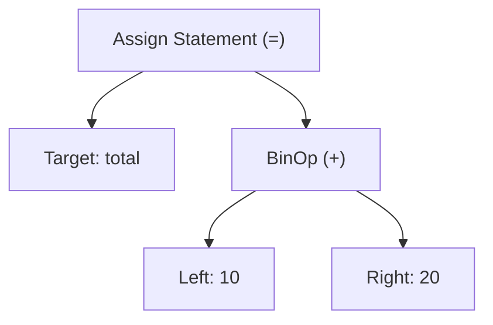

# Deep-Dive Notes: Python Architecture & CPython Execution Flow

---

## 1. Introduction & High-Level Definition

**Python** is a high-level, dynamically typed, multi-paradigm, garbage-collected programming language created by **Guido van Rossum** in 1991. 

While developers often classify languages strictly as either **Compiled** (like C, C++, Rust) or **Interpreted** (like Bash, JavaScript in simple engines), Python is technically **both**. Python source code is first compiled into an intermediate form called **Bytecode**, which is then interpreted by a Virtual Machine called the **Python Virtual Machine (PVM)**.

```
+------------------+      +-------------------+      +-----------------------+
|  Python Source   | ---> |  CPython Compiler | ---> |   CPython Bytecode    |
|    (.py file)    |      | (Lex/Parse/AST)   |      | (.pyc / Code Object)  |
+------------------+      +-------------------+      +-----------------------+
                                                                 |
                                                                 v
                                                     +-----------------------+
                                                     | Python Virtual Machine|
                                                     |    (PVM Stack Loop)   |
                                                     +-----------------------+
                                                                 |
                                                                 v
                                                     +-----------------------+
                                                     | Machine Code Execution|
                                                     |      (CPU / OS)       |
                                                     +-----------------------+
```

---

## 2. Implementations of Python: CPython vs. Others

Python is a **language specification**. **CPython** is the reference implementation written in C.

| Implementation | Written In | Primary Target / Use Case | JIT Compilation? |
| :--- | :--- | :--- | :--- |
| **CPython** | C | Official Reference Implementation (Default) | No (Traditional PVM) |
| **PyPy** | RPython | High-performance execution via JIT | Yes (Very Fast) |
| **Jython** | Java | Integration with Java Virtual Machine (JVM) | Compiles to Java Bytecode |
| **IronPython**| C# | Integration with .NET Framework / CLR | Compiles to CLR Bytecode |

> **Note**: Unless specified otherwise, when developers say "Python", they are referring to **CPython**.

---

## 3. Real-World Analogy: The Restaurant Kitchen Model

Imagine ordering a meal at an upscale restaurant:

1. **Source Code (`.py`)** = **The Written Recipe**: A human-readable recipe written in English containing steps to prepare a dish.
2. **Lexer & Parser (AST)** = **Head Chef Reading & Validating**: The head chef reads the recipe, ensures syntax is valid (e.g., no impossible instructions like "cook ice at 500°C"), and organizes ingredients into an orderly prep list.
3. **Bytecode Compilation (`.pyc`)** = **Prepped Ingredients & Ticket**: The recipe is converted into structured, standardized kitchen tickets and measured ingredient bowls ready for instant assembly.
4. **Python Virtual Machine (PVM)** = **Line Cook Execution Loop**: The line cook steps through each ticket item sequentially, executing instructions step-by-step using kitchen tools (CPU).

---

## 4. The 5 Stages of Python Execution

When you run `python script.py` in your terminal, CPython executes five distinct phases:

### Phase 1: Lexical Analysis (Tokenization)
The CPython Lexer reads raw source code characters and breaks them into a stream of primitive atomic units called **Tokens** (e.g., keywords, identifiers, operators, literals).

- **Input Source Code**: `total = 10 + 20`
- **Output Tokens**:
  - `NAME 'total'`
  - `EQUAL '='`
  - `NUMBER '10'`
  - `PLUS '+'`
  - `NUMBER '20'`

### Phase 2: Parsing & Abstract Syntax Tree (AST)
The Parser receives the token stream and verifies syntactic grammar according to Python's formal grammar rules. If syntax is valid, it builds an **Abstract Syntax Tree (AST)**—a hierarchical tree structure representing program semantics.



### Phase 3: Bytecode Compilation
The CPython compiler walks the AST and translates high-level logic into low-level stack instructions called **Bytecode**. Bytecode consists of 1-byte instruction opcodes (hence "byte"-code).

- Compiled bytecode is stored in memory inside a **Code Object** (`PyCodeObject`).
- When modules are imported, CPython caches bytecode on disk inside the `__pycache__/` directory as `.pyc` files to accelerate future startup speeds.

### Phase 4: Python Virtual Machine (PVM) Execution
The **PVM** is the core interpreter engine (`ceval.c` in CPython source code). It is a **stack-based evaluation loop**:
- It maintains an **Evaluation Stack** for operands.
- It steps through opcode instructions one by one.
- It pushes values onto the stack, performs opcode operations (e.g., `BINARY_ADD`), pops results, and stores variables in local/global scope dictionaries.

### Phase 5: CPU Machine Code Execution
The C functions inside CPython execute corresponding native CPU machine instructions, producing output on stdout, modifying memory, or writing to disk.

---

## 5. CPython Bytecode & Disassembly Deep-Dive

Python provides a built-in module named `dis` (Disassembler) that allows us to inspect the raw bytecode of any function or code block.

### Example Code
```python
def add_numbers(a: int, b: int) -> int:
    result = a + b
    return result
```

### Disassembled Bytecode (`dis.dis(add_numbers)`)
```text
  2           0 RESUME                   0

  3           2 LOAD_FAST                0 (a)
              4 LOAD_FAST                1 (b)
              6 BINARY_ADD
              8 STORE_FAST               2 (result)

  4          10 LOAD_FAST                2 (result)
             12 RETURN_VALUE
```

### Opcode Step-by-Step Stack Explanation

| Byte Offset | Opcode | Instruction Description | Evaluation Stack State |
| :--- | :--- | :--- | :--- |
| `2` | `LOAD_FAST 0 (a)` | Push value of local variable `a` onto stack | `[a]` |
| `4` | `LOAD_FAST 1 (b)` | Push value of local variable `b` onto stack | `[a, b]` |
| `6` | `BINARY_ADD` | Pop top 2 items (`b`, `a`), add them, push result | `[a + b]` |
| `8` | `STORE_FAST 2` | Pop top item and store in local variable `result` | `[]` (Empty) |
| `10` | `LOAD_FAST 2` | Push value of `result` onto stack for return | `[result]` |
| `12` | `RETURN_VALUE` | Return top stack item to caller frame | `[]` |

---

## 6. The Global Interpreter Lock (GIL)

### Definition
The **Global Interpreter Lock (GIL)** is a mutual-exclusion lock (mutex) used by CPython to prevent multiple native CPU threads from executing Python bytecode simultaneously on separate CPU cores.

```
       +-------------------------------------------------------+
       |             CPython Process (Single GIL)              |
       |                                                       |
       |  +------------------+         +------------------+    |
       |  | Thread 1 (Holds) |         | Thread 2 (Waits) |    |
       |  +------------------+         +------------------+    |
       |           |                            |              |
       |           v                            x              |
       |     +-------------------------------------+           |
       |     |        CPython PVM Interpreter      |           |
       |     +-------------------------------------+           |
       +-------------------------------------------------------+
```

### Why does CPython have a GIL?
CPython uses **Reference Counting** for memory management. Every Python object has a `ob_refcnt` header field tracking how many references point to it. Without a lock, two threads incrementing or decrementing reference counts simultaneously would create race conditions, leading to memory leaks or premature garbage collection crashes.

### Impact of the GIL
1. **I/O-Bound Tasks** (Web requests, File read/write, DB queries): **Multithreading works great!** Threads release the GIL while waiting for OS I/O operations.
2. **CPU-Bound Tasks** (Image processing, Machine Learning, Data crunching): **Multithreading gives NO speedup!** Only one thread executes bytecode at any instant. Use **Multiprocessing** (`multiprocessing` module) to spawn separate CPython processes with independent GILs.

---

## 7. Best Practices & Pythonic Standards

- **Embrace `.pyc` caching**: Do not manually delete `__pycache__` directories in production unless troubleshooting corrupted builds. Add `__pycache__/` and `*.pyc` to your `.gitignore`.
- **Use `dis` for Performance Analysis**: Before optimizing a tight loop, disassemble it to see if you can reduce opcode counts (e.g., local variable lookups are faster via `LOAD_FAST` than global lookups via `LOAD_GLOBAL`).
- **Structure Code into Functions**: Code inside functions runs noticeably faster in CPython than code at the top-level global scope because local variables use array-indexed `LOAD_FAST` instructions rather than hash-map dictionary lookups (`LOAD_GLOBAL`).

---

## 8. Common Developer Mistakes

1. **Mistake**: Assuming Python is line-by-line interpreted without compilation.
   - *Correction*: Python compiles source code into Bytecode before executing line 1! Syntax errors are caught during AST parsing before *any* runtime code executes.
2. **Mistake**: Believing Python threads will speed up heavy mathematical calculations across 8 CPU cores.
   - *Correction*: Due to the GIL, CPython threads run on a single CPU core for CPU-bound tasks. Use process pools (`concurrent.futures.ProcessPoolExecutor`) for parallel core utilization.

---

## 9. Key Interview Questions & Concise Answers

### Q1: Is Python an interpreted or compiled language?
> **Answer**: Python is both compiled and interpreted. CPython first compiles `.py` source files into bytecode (`.pyc` / Code Objects). The Python Virtual Machine (PVM) then interprets this bytecode instruction by instruction into machine code.

### Q2: What is the purpose of the `__pycache__` directory?
> **Answer**: `__pycache__` stores compiled bytecode (`.pyc`) files generated when modules are imported. It prevents CPython from needing to re-parse and re-compile module source code on every subsequent execution, significantly improving application startup time.

### Q3: What is the GIL, and how does it affect multi-threaded Python programs?
> **Answer**: The Global Interpreter Lock (GIL) is a mutex in CPython that ensures only one native thread executes Python bytecode at a time. It protects CPython's reference counting memory management from race conditions. As a result, Python threads do not achieve true CPU parallelism for CPU-bound tasks, but work effectively for I/O-bound tasks.

---

## 10. Summary Cheat Sheet

- **Source Code**: `.py` file (human readable).
- **Lexer/Parser**: Converts text to **Tokens** -> **AST**.
- **Bytecode**: Machine-independent intermediate code (`co_code`).
- **Code Object**: Contains bytecode, constants (`co_consts`), names (`co_names`), and local variables (`co_varnames`).
- **PVM**: Stack-based execution engine (`ceval.c`).
- **Disassembler**: Use `import dis; dis.dis(fn)` to view opcodes.
